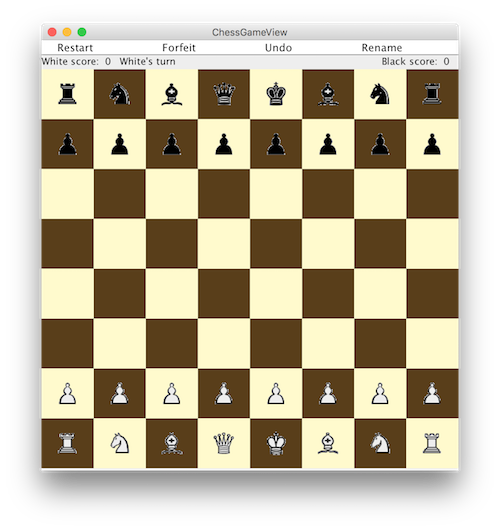

# Chess
A java implementation of chess game with a graphic user interface.

## Features
* Robust detection of checkmate and stalemate
* Highlight all valid movements of selected pieces
* Support undo, forfeit, restart and rename
